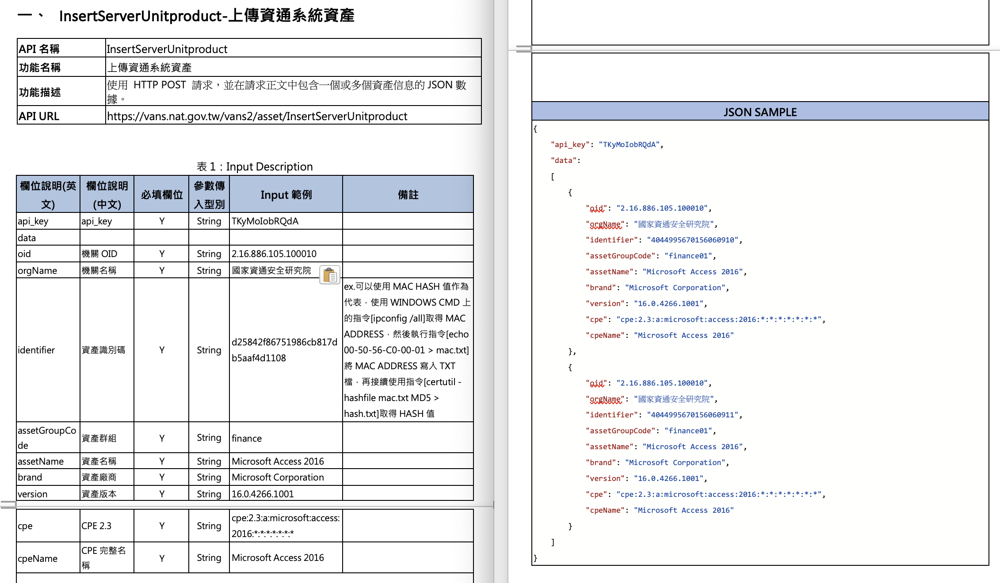
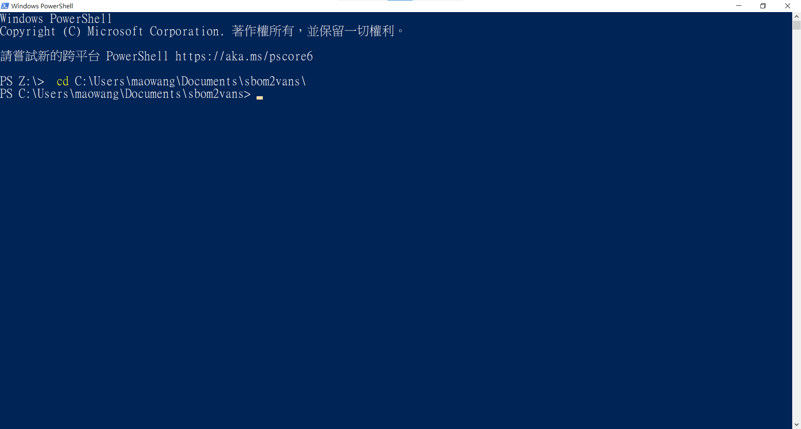
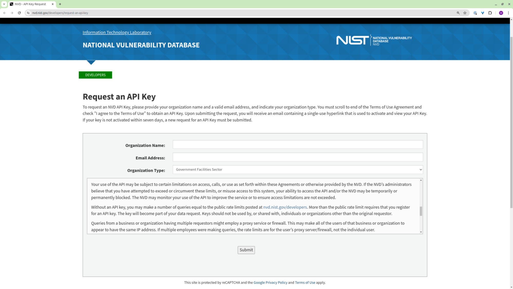

# SBOM 銜接 VANS 規格工具（sbom2vans）說明

## 名詞說明

### SBOM（Software Bill of Materials）

SBOM 提供軟體中包含的所有函式庫與組件的清單，還會列出版本號、原始碼來源與關聯資訊。SBOM 的目的是讓使用者或開發者了解軟體的組成，這樣在發生安全事件或需要更新時，能夠快速識別與應對。

### OSV（[Open Source Vulnerability](https://osv.dev/)）

一款由 Google 開源漏洞(Open Source Vulnerability，OSV)資料庫，透過 OSV 格式存儲漏洞資訊。OSV-Scanner 會基於 OSV 資料庫評估專案的依賴關係，顯示與專案相關的所有漏洞，開發人員可以快速查詢其軟體組件是否存在已知的安全問題。

### NVD（[National Vulnerability Database](https://nvd.nist.gov/)）

NVD 是美國政府的標準基礎漏洞管理資料庫，使用安全內容自動化協定(SCAP)表示。這些資料可用於漏洞管理、安全度量與合規性自動化。NVD 含安全檢查清單參考、與安全相關的軟體缺陷、產品名稱與影響度指標的資料庫。

### 資通安全弱點通報系統（[Vulnerability Analysis and Notice System](https://www.nics.nat.gov.tw/core_business/cybersecurity_defense/VANS/)，簡稱 VANS）

VANS 結合資訊資產管理與弱點管理，掌握整體風險情勢，並協助機關落實資通安全管理法之資產盤點與風險評估應辦事項。此工具使用 VANS 資訊資產 API 進行上傳，參數說明詳見下圖（來源 VANS 系統API 功能說明）。



### sbom2vans

此工具協助轉換 SBOM 文件符合 VANS 格式，呼叫 OSV API 查詢資料庫確認組件是否有已知的安全漏洞，並使用 NVD API 查詢已知漏洞對應 CPE 格式，若無 CVE 或 CPE 格式元件則會以 package-url 格式儲存，最後將 SBOM 內套件轉轉換符合 VANS 格式欄位進行上傳。本專案於 GitHub 以[開源專案](https://github.com/nics-tw/sbom2vans)釋出。

## 工具用途

本工具旨在協助政府機關(構)將其產生的 SBOM 檔案上傳至 VANS。工具主要功能如下：

- 格式轉換：本工具支援將符合 SPDX (Software Package Data Exchange) 或 CycloneDX 兩種標準格式的 SBOM 檔案，轉換為 VANS  系統所要求的特定格式。
- 自動上傳：轉換後的 SBOM 檔案將自動上傳至 VANS 系統，無需人工介入，簡化了提交流程。

透過本工具，政府機關(構)可以更有效的將其資訊系統元件盤點資料提交至 VANS 系統，同時確保資料格式的準確性與相容性，提升整體作業效率。

## 使用對象

本工具的服務對象為符合以下兩個條件的政府機關(構)：

1. 已使用 SBOM 開源工具完成資訊系統元件盤點，並產生符合 SPDX（Software Package Data Exchange）或 CycloneDX 格式標準的 SBOM 檔案。
2. 需要將資訊系統元件盤點資料提交至 VANS 。

符合上述兩個條件的政府機關(構)即可使用本工具，將其產生的 SBOM 檔案上傳至 VANS 系統，以完成資訊系統元件盤點資料的提交作業。

## 使用時機

配合定期上傳資訊資產盤點資料上傳頻率，使用 sbom2vans 將定期盤點系統之 SBOM 文件更新至 VANS 系統。其建議更新頻率[參考 VANS 建議](https://www.nics.nat.gov.tw/core_business/cybersecurity_defense/VANS/faq/)應為每個月定期上傳 1 次。

## SBOM 轉換 CPE 格式應用於 VANS 之銜接機制

### 一、流程說明


1. 讀取 SBOM 檔案(支援 OWASP CycloneDX 及 SPDX)兩種格式，於 GitHub `/test` 目錄提供 [CycloneDX 格式測試檔案](./test/cyclonedx.json) 及 [SPDX 格式測試檔案](./test/spdx.json)。
2. 查詢 OSV 是否有 CVE 漏洞
3. 取得具有 CVE 漏洞套件元件
    1. 若無 CPE 資料，VANS API cpe23 欄位填寫 `N/A` ，並將套件名稱以 package-url 格式存入 `product_name` 欄位
    2. 有 CPE 資料則繼續第四步驟
4. 簡易比對 CPE 格式及套件名稱
    1. 若無法成功比對，VANS API cpe23 欄位填寫 `N/A`，並將套件名稱以 package-url 格式存入 `product_name` 欄位
    2. 若比對成功，cpe23 欄位填入 CPE
5. 彙整成 VANS API 格式 JSON 資料
6. 透過 API 上傳至 VANS。同時，輸出具有 CVE 資料於命令列畫面。

### 二、已知限制

目前已知以下兩種狀況無法成功轉換 CPE：

1. 新產生的 CVE 漏洞，但是套件尚未有於 NVD 上建立 CPE 資料，故 CVE 上並未關聯對應 CPE 套件資訊。以 NPM Vite 5.0.12，可以查詢到 CVE [CVE-2024-31207](https://nvd.nist.gov/vuln/detail/CVE-2024-31207)，但無 CPE 對照資訊。
2. SBOM 套件名稱為主要以 package-url 欄位 namespace 及 name 組成，已知 SBOM 名稱及 CPE Vender 欄位名稱差異及 CPE Product 欄位並不一定統一為語言或套件來源。以 golang 套件 `github.com/dgrijalva/jwt-go` 及 `golang.org/x/net` 為例，詳見下表。可以觀察到 SBOM 套件名稱及 CPE Vender 欄位上名稱差異，另外 Product 欄位並未統一為 golang 語言。

| SBOM 名稱                   | CPE Vendor     | CPE Product 欄位 |
|-----------------------------|----------------|------------------|
| github.com/dgrijalva/jwt-go | jwt-go_project | jwt-go           |
| golang.org/x/net            | golang         | networking       |

## 預期產出

依據「SBOM 轉換 CPE 格式應用於 VANS 之銜接機制」段落，sbom2van 先經查詢開源 OSV 資料庫取得具有 CVE 漏洞函式庫元件，可以彌補 VANS 使用 NVD 資料庫而尚未有 CVE 資訊，將具有 CVE
漏洞之函式庫元件輸出顯示於終端機，同時上傳由 SBOM 格式資料轉換資產盤點資料至 VANS 系統。


## 使用效益

sbom2vans 能夠確保 SBOM 文件符合 VANS 格式的要求，有助於機構遵循資通安全管理法的規範，並且在資產盤點與風險評估方面達到合規性要求，進而讓機關可以定期使用 SBOM 工具盤點系統元件函式庫元件並自動上傳至 VANS。

## sbom2vans 使用環境說明

- 存取外部網路功能(此轉換工具需連線至 OSV、NVD 及 VANS API)
- VANS 機關資產管理 API key。若無 VANS API key，請參考[資通安全弱點通報系統](https://download.nics.nat.gov.tw/UploadFile/vans/%E6%96%B0%E7%89%88%E8%B3%87%E9%80%9A%E5%AE%89%E5%85%A8%E5%BC%B1%E9%BB%9E%E9%80%9A%E5%A0%B1%E7%B3%BB%E7%B5%B1(VANS%202.0)%E7%B7%9A%E4%B8%8A%E8%AA%AA%E6%98%8E%E6%9C%83.pdf)申請帳號及申請 API key
- SBOM 文件（支援 CycloneDX 或 SPDX 格式）。若無 SBOM 文件，請參考[SBOM 開源工具使用說明](https://download.nics.nat.gov.tw/UploadFile/attachfilenew/SBOM%E9%96%8B%E6%BA%90%E5%B7%A5%E5%85%B7%E4%BD%BF%E7%94%A8%E8%AA%AA%E6%98%8E_v4.2.pdf)進行掃描取得 SBOM 文件。
- NVD API key。若無 NVD API Key，請參考《附錄：申請 NVD API Key 步驟》。

### 一、檢視環境 CPU 架構

#### (一) Windows 環境

1. 搜尋並開啟「命令提示字元」。
    

2. 於命令提示字元，輸入以下命令。回傳顯示則為環境使用的 CPU 架構，AMD64 代表 64 bit CPU 架構。

    ```
    > echo %PROCESSOR_ARCHITECTURE%
    ```

    

#### (二) macOS 或 Linux 環境

1. 開啟終端機(Terminal)應用程式
2. 使用以下 uname 命令。如下圖，macOS 環境取得 arm64 代表使用 Arm 架構 64 bit，Linux 環境取得 `x86_64` 代表使用 AMD 架構 64 bit。

    ```
    uname -m
    ```

    macOS 環境檢視 CPU 架構
    

    Linux 環境檢視 CPU 架構
    

### 二、下載 sbom2vans 工具

1. 至 GitHub sbom2vans 工具 [releases](https://github.com/nics-tw/sbom2vans/releases/latest)。其 release 名稱說明如下：

    ```
    sbom2vans-{版本號}-{作業系統}-{CPU 架構}.tar.gz
    ```

    如：sbom2vans-v0.0.1-linux-amd64.tar.gz

    - 版本號：v0.0.1
    - 作業系統環境：Linux
    - CPU 架構：`x86_64`

    

2. 依據前一段落(一、檢視環境 CPU 架構)取得 CPU 架構，依據執行環境的作業系統點選下載。以下舉例環境、CPU 架構及下載 sbom2vans 檔名：

    - Linux 環境及 CPU `x86_64` 架構：`sbom2vans-v0.0.1-linux-amd64.tar.gz`
    - macOS 環境及 CPU `arm64` 架構：`sbom2vans-v0.0.1-darwin-arm64.tar.gz`
    - Windows 環境及 CPU `amd64` 架構：`sbom2vans-v0.0.1-windows-amd64.zip`

3. 解壓縮上一步驟下載檔案，則可以取得 sbom2vans 工具。

    - macOS 或 Linux 環境：使用以下 tar 命令解壓縮。
        ```
        tar zxvf ./sbom2vans-v0.0.1-darwin-arm64.tar.gz
        ```

        

    - Windows 則可以使用內建 zip 解壓縮或是 WinRAR 進行解壓縮檔案。

### 三、使用說明

sbom2vans（或 sbom2vans.exe）支援以下參數：

```
$ ./sbom2vans -h
SBOM 轉換為 VANS 機關資產管理 CLI 工具

Usage:
  sbom2vans [flags]

Flags:
  -h, --help help for sbom2vans
  -i, --input-file string 指定 SBOM 檔案目錄位置
  --nvd-key string 指定 NVD API key
  -o, --oid string 機關 Object Identifier (OID)，可以至 OID 網站 https://oid.nat.gov.tw/OIDWeb/ 查詢
  -u, --unit-name string 機關名稱，如：監察院
  -g, --group string 指定資產群組代碼
  -k, --vans-key string 指定 VANS 機關資產管理 API key
      --vans-url string VANS API URL (default "https://vans.nat.gov.tw")
```

依據上述參數分別填寫，以下範例參數：

- `-u`：機關名稱，如「監察院」
- `-o`, `--oid`：機關 OID
- `-i`：SBOM 文件路徑
- `-g`, `--group`：指定資產群組代碼
- `-k`, `--vans-key`：[VANS API key](#sbom2vans-%E4%BD%BF%E7%94%A8%E7%92%B0%E5%A2%83%E8%AA%AA%E6%98%8E)
- `--vans-url`：預設為 VANS 正式環境 URL，可自定義測試 URL
- `--nvd-key`：指定 NVD API key

#### 新增資產群組

需事先於 vans 系統新增資產群組，自定義資產群組代碼，以方便後續管理不同系統之 SBOM。

新增資產群組


設定資產群組代碼


#### (一) Windows 環境

1. 開啟 Windows PowerShell。

    

2. 切換至下載 sbom2vans 目錄。以下範例為切換至  `C:\Users\maowang\Documents\sbom2vans\`。

    ```
    > cd [下載解壓縮後 sbom2vans 目錄]

    # 範例

    > cd C:\Users\maowang\Documents\sbom2vans\
    ```

    

3. 執行 sbom2vans 工具。

    cmd
    ```
    > .\sbom2vans.exe -u "監察院" --oid 2.16.886.101.20007 ^
    -i .\test-sbom\manifest\spdx\_2.2\manifest.spdx.json ^
    -g "test-project" ^
    -k "l62RiXYJkIVT...請至 VANS 申請 API KEY...0cWPhcg1E" ^
    --nvd-key "65xxxxxx-12ab-cd45-ef78-xxxxxxxxxx31"
    ```

    PowerShell
    ```
    > .\sbom2vans.exe -u "監察院" --oid 2.16.886.101.20007 `
    -i .\test-sbom\manifest\spdx\_2.2\manifest.spdx.json `
    -g "test-project" `
    -k "l62RiXYJkIVT...請至 VANS 申請 API KEY...0cWPhcg1E" `
    --nvd-key "65xxxxxx-12ab-cd45-ef78-xxxxxxxxxx31"
    ```

#### （二）macOS 環境或 Linux 環境

1. 開啟終端機（Terminal）應用程式
2. 切換至下載 sbom2vans 目錄。以下命令範例為切換至 `~/Project/vans-testing` 目錄。

    ```
    $ cd \[下載解壓縮後 sbom2vans 目錄\]

    # 範例

    $ cd ~/Project/vans-testing
    ```

3. 執行 sbom2vans 工具，指令如下。

   附註：於 macOS 作業環境第一次執行時，可能會遭遇到安全性問題，請參考下方《macOS 作業系統允許內建 Gatekeeper 第三方應用程式執行》步驟。

    ```
    $ ./sbom2vans -u "監察院" --oid 2.16.886.101.20007 \
    -i "/Users/focaaby/Project/testing-sbom/_manifest/spdx_2.2/manifest.spdx.json" \
    -g "test-project" \
    --vans-key "l62RiXYJkIVT...請至 VANS 使用...0cWPhcg1E" \
    --nvd-key "65xxxxxx-12ab-cd45-ef78-xxxxxxxxxx31"

    ```

#### （三）macOS 作業系統允許內建 Gatekeeper 第三方應用程式執行

macOS 執行 sbom2vans 安全性提示


若遭遇上圖狀況，請使用以下 spctl 命令允許第三方應用程式執行。

```
sudo spctl --master-disable
```

#### （四）存取至測試環境

可以使用 --vans-url 參數指定 VANS API URL，假如為內網 IP 為 10.x.x.x 則可以指定為 `--vans-url https://10.x.x.x` 以下分別為 Windows 及
macOS/Linux 使用參數範例：

```
## Windows
> .\sbom2vans.exe -u "監察院" --oid 2.16.886.101.20007 -i .\test-sbom\_manifest\spdx_2.2\manifest.spdx.json -g "test-project" -k "l62RiXYJkIVT...請至 VANS 申請 API KEY...0cWPhcg1E" --nvd-key "65xxxxxx-12ab-cd45-ef78-xxxxxxxxxx31" --vans-url "https://10.x.x.x/VANS-DEMO"

## macOS 或 Linux
./sbom2vans -u "監察院" --oid 2.16.886.101.20007 \
-i "/Users/focaaby/Project/testing-sbom/_manifest/spdx_2.2/manifest.spdx.json" \
-g "test-project" \
--vans-key "l62RiXYJkIVT...請至 VANS 使用...0cWPhcg1E" \
--nvd-key "65xxxxxx-12ab-cd45-ef78-xxxxxxxxxx31" \
--vans-url "https://10.x.x.x/VANS-DEMO"
```

### 四、VANS 檢視上傳資料

至 VANS 系統上「資產管理 -> 資通系統資產」檢視上傳資料。


## 附錄一：申請 NVD API Key 步驟

1. 請至 [NVD Request an API Key](https://nvd.nist.gov/developers/request-an-api-key) 頁面。填寫 Organization 名稱、Email 及 Organization 類型。

    

2. 申請通過後，則會於上述您填寫的 Email 收到 NVD API Key 的連結。

    

3. 打開第二步驟信件內連結，啟用 NVD API key。內文如下範例，其 API KEY 為 sbom2vans 工具NVD API key 參數。

```
NVD API Key Activated

Thank you for confirming your request for an NVD API key. Please
securely save this key. Once you close or leave this page, the key will
no longer be accessible from this link. If you lose or forget your API
key you must request a new one. There is no process for recovering an
API Key.

API Key: 65xxxxxx-12ab-cd45-ef78-xxxxxxxxxx31

To request a new API key, please resubmit an API Key Request. Please
note that activating a new key will deactivate the key shown above.
```
